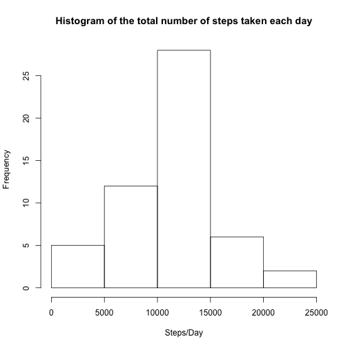
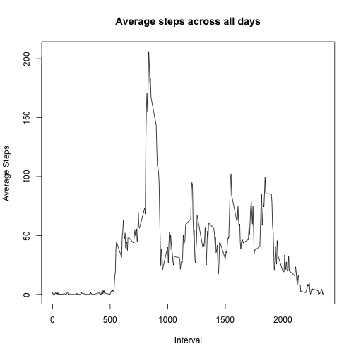
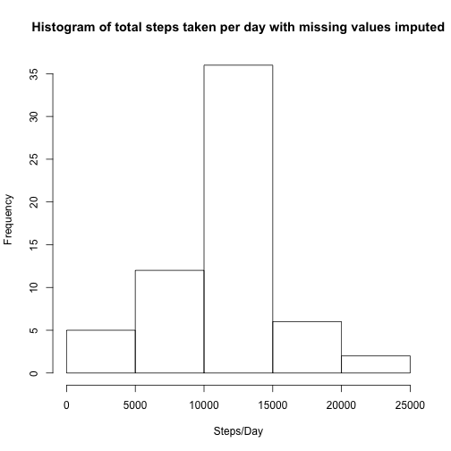

```r
---
title: "Reproducible Research : course_project_1"
output: html_document
---
```

```
## Error: <text>:5:0: unexpected end of input
## 3: output: html_document
## 4: ---
##   ^
```


## Loading and preprocessing the data


    1.Read the activity.csv file
    2.Call summary and get info on the file
    3.Remove NAs
    4.Convert factor date to date

```r
    activity_csv <- read.csv("activity.csv",  header = TRUE )
    summary(activity_csv)
```

```
##      steps                date          interval     
##  Min.   :  0.00   2012-10-01:  288   Min.   :   0.0  
##  1st Qu.:  0.00   2012-10-02:  288   1st Qu.: 588.8  
##  Median :  0.00   2012-10-03:  288   Median :1177.5  
##  Mean   : 37.38   2012-10-04:  288   Mean   :1177.5  
##  3rd Qu.: 12.00   2012-10-05:  288   3rd Qu.:1766.2  
##  Max.   :806.00   2012-10-06:  288   Max.   :2355.0  
##  NA's   :2304     (Other)   :15840
```

```r
    clean_activity_csv <- na.omit(activity_csv)
    clean_activity_csv$date <- as.Date(clean_activity_csv$date, format = "%Y-%m-%d")
```

## What is mean total number of steps taken per day?
* Calculate the total number of steps taken per day
* If you do not understand the difference between a histogram and a barplot,   research the difference between them. Make a histogram of the total number of steps taken each day
* Calculate and report the mean and median of the total number of steps taken per day

Solution:
    Step 1. Determine the total steps per day using the aggregate function
    Step 2. Plot the histogram using the hist function
    Step 3. Determine mean and medium from the data frame from step 1.


```r
    steps_per_day <- aggregate(steps ~ date , clean_activity_csv, sum)
    hist(steps_per_day$steps , 
     main = "Histogram of the total number of steps taken each day", xlab="Steps/Day")
```



```r
    mean_steps <- mean(steps_per_day$steps)
    median_steps <- median(steps_per_day$steps)
```
The mean total steps taken is 10766.19 and median of total steps is 10765.

## What is the average daily activity pattern?


* Make a time series plot (i.e. 𝚝𝚢𝚙𝚎 = "𝚕") of the 5-minute interval (x-axis) and the average number of steps taken, averaged across all days (y-axis)

Solution:

    Step 1. First aggregate the data by five minute intervals
    Step 2. Plot the time series chart

```r
    mean_steps_per_interval <- aggregate(steps ~ interval, clean_activity_csv, mean)
    plot(mean_steps_per_interval$interval, mean_steps_per_interval$steps, xlab="Interval", ylab="Average Steps", main="Average steps across all days", type="l"
)
```



* Which 5-minute interval, on average across all the days in the dataset, contains the maximum number of steps?

Solution:

    Step 1. Identify the index of the interval with max value
    Step 2. Using the index determine the interval with max value and max steps
    

```r
    interval_index <- which.max(mean_steps_per_interval$steps)
    max_values <- mean_steps_per_interval[interval_index,]
    max_steps <- max_values$steps
    max_interval <- max_values$interval
```
The 5-minute interval that contains the maximum number of steps is 835.
    
## Imputing missing values

1. Calculate and report the total number of missing values in the dataset (i.e. the total number of rows with 𝙽𝙰s)


```r
    summary(activity_csv)
```

```
##      steps                date          interval     
##  Min.   :  0.00   2012-10-01:  288   Min.   :   0.0  
##  1st Qu.:  0.00   2012-10-02:  288   1st Qu.: 588.8  
##  Median :  0.00   2012-10-03:  288   Median :1177.5  
##  Mean   : 37.38   2012-10-04:  288   Mean   :1177.5  
##  3rd Qu.: 12.00   2012-10-05:  288   3rd Qu.:1766.2  
##  Max.   :806.00   2012-10-06:  288   Max.   :2355.0  
##  NA's   :2304     (Other)   :15840
```

```r
    missing_values = sum(is.na(activity_csv$steps))
```

The total number of missing values in the dataset is 2304.

2. Devise a strategy for filling in all of the missing values in the dataset. The strategy does not need to be sophisticated. For example, you could use the mean/median for that day, or the mean for that 5-minute interval, etc.

Solution: The strategy I decided to use is the mean value for the 5-minute interval. So missing values will be imputed with the mean value for the 5 min interval.

3. Create a new dataset that is equal to the original dataset but with the missing data filled in.

```r
    imputed_activity_csv <- cbind(activity_csv) # new dataset to impute
    for(i in 1:nrow(imputed_activity_csv)){
        if(is.na(imputed_activity_csv$steps[i])){
            # Determine which interval does a missing value belong
            act_interval <- imputed_activity_csv$interval[i]
            impute_value <- mean_steps_per_interval$steps[which(mean_steps_per_interval$interval == act_interval)]
            imputed_activity_csv$steps[i] <- impute_value
        }
    }
```
The new dataset with imputed values is imputed_activity_csv.

4. Make a histogram of the total number of steps taken each day and Calculate and report the mean and median total number of steps taken per day. Do these values differ from the estimates from the first part of the assignment? What is the impact of imputing missing data on the estimates of the total daily number of steps?


```r
    imputed_steps_per_day <- aggregate(steps ~ date , imputed_activity_csv, sum)
    hist(imputed_steps_per_day$steps , 
     main = "Histogram of total steps taken per day with missing values imputed", xlab="Steps/Day")
```



```r
    imputed_mean_steps <- mean(imputed_steps_per_day$steps)
    imputed_median_steps <- median(imputed_steps_per_day$steps)
```
The mean value of dataset with imputed values is 10766.189 and median value of dataset with imputed values is 10766.189.

The impact of imputing the missing data is not significant , the mean value remains the same and the median moves up a little closer to the mean .

## Are there differences in activity patterns between weekdays and weekends?

1. Create a new factor variable in the dataset with two levels – “weekday” and “weekend” indicating whether a given date is a weekday or weekend day.


```r
    imputed_activity_csv$date <- as.Date(imputed_activity_csv$date, format = "%Y-%m-%d")
    day_of_the_week <- weekdays(x=imputed_activity_csv$date)
    for ( i in 1:length(day_of_the_week)){  # determine if weekday or weekend
        if (day_of_the_week[i] %in% c("Saturday","Sunday"))
            day_of_the_week[i] = "weekend"
        else
            day_of_the_week[i] = "weekday"
}
imputed_activity_csv$day <- as.factor(day_of_the_week) # add in a new factor variable day.
```

2. Make a panel plot containing a time series plot (i.e. 𝚝𝚢𝚙𝚎 = "𝚕") of the 5-minute interval (x-axis) and the average number of steps taken, averaged across all weekday days or weekend days (y-axis). See the README file in the GitHub repository to see an example of what this plot should look like using simulated data.


```r
    library(ggplot2)
    imputed_steps_per_week <- aggregate(steps ~ interval+day, imputed_activity_csv, mean)
    ggplot(imputed_steps_per_week, aes(x = interval, y = steps)) + geom_line() + 
    facet_wrap( ~ day, nrow = 2, ncol = 1)   + labs(x = "Interval", y = "Number of steps")  + theme_bw()
```


There is some difference in the activity patterns between weekday and weekends. The maximum recorded mean steps occurs on a weekday. The activity levels on a weekday have the max recorded value but then the activity levels tend to go down . The weekend activity levels stay consistent pretty much throughout the day.
```
```

